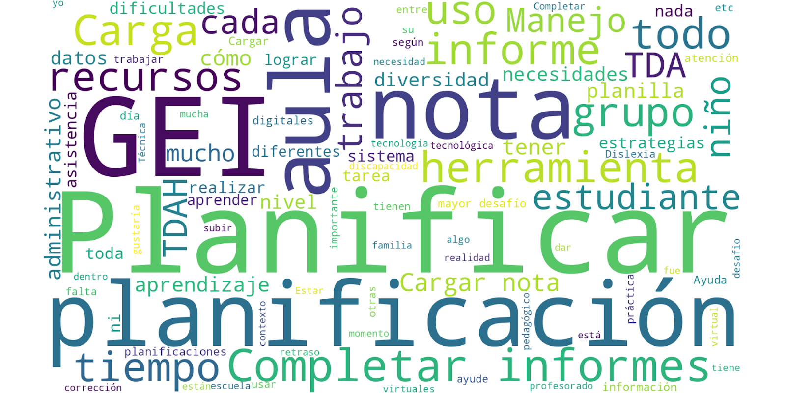
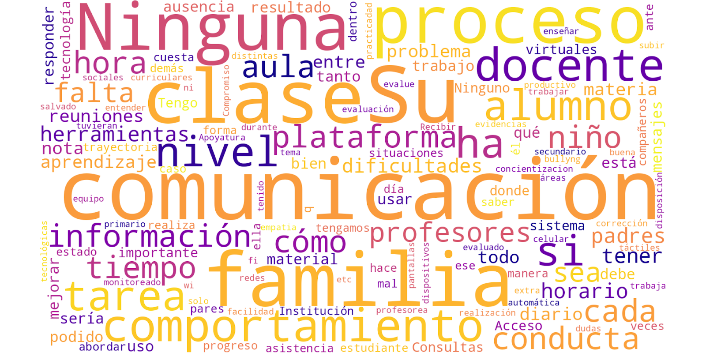
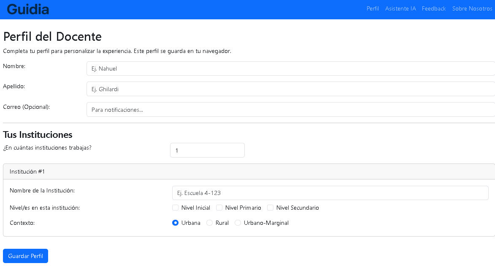
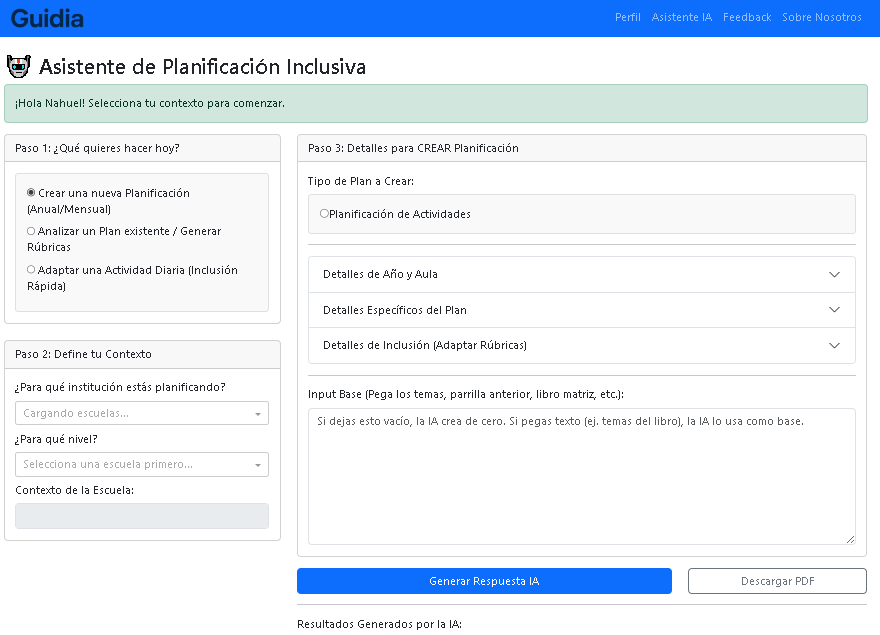

# 🚀 Guidia: Asistente de Planificación Inclusiva con IA


[](https://www.python.org/)
[](https://dash.plotly.com/)
[](https://ai.google.dev/)
[](https://guidia.onrender.com)

> **Proyecto Finalista (Top 5 estimado) del Hackaton EduTech 360 Mendoza 2025.**
> Solución desarrollada en 48 horas para atacar la burocracia docente y mejorar la inclusión educativa.

🔗 **[Ver Demo en Vivo](https://guidia.onrender.com)** *(Nota: Al estar en un plan gratuito, la app puede tardar unos 30-60 segundos en "despertar" la primera vez).*

---

## 🧐 El Problema (Validado por Datos)

No adivinamos. Antes de escribir una sola línea de código, realizamos una investigación de mercado encuestando a **99 personas** (62 docentes y 37 padres) en la provincia de Mendoza.

Encontramos un "doble dolor" que desconecta a la escuela de la familia:

### 1. El Dolor del Docente: "Falta de Tiempo y Herramientas"
El **35.5%** de los docentes se siente "poco preparado" para afrontar los desafíos de inclusión en el aula. Su mayor obstáculo no es la falta de vocación, es la carga administrativa.


*Como se ve en el gráfico, la "Planificación", la "Burocracia" y la "Inclusión" son los tópicos más críticos.*

### 2. El Dolor de la Familia: "Falta de Claridad"
El **43.2%** de los padres se siente "confundido" con los informes escolares. No piden más notas numéricas; piden entender el **proceso** y cómo se evalúa a sus hijos.



---

## 💡 La Solución: Guidia

Guidia no es otro sistema de gestión. Es un **co-piloto de Inteligencia Artificial** que actúa como puente entre la burocracia y la pedagogía.

### Funcionalidades Clave:
* **🧠 Contexto Inteligente:** La app entiende si el docente es de Primaria o Secundaria (adaptando los inputs como "Días Patrios" o "Libro Matriz") y si la escuela es Rural o Urbana.
* **⚡ Generación Automática:** Crea planificaciones Anuales, Mensuales o Diarias en segundos.
* **🤝 Inclusión Real:** Sugiere adaptaciones específicas para TDAH, Dislexia, TEA, etc., integradas en la planificación.
* **📊 Generador de Rúbricas (El Puente):** Crea automáticamente las rúbricas de evaluación explicadas, listas para que el docente se las entregue a los padres, solucionando el problema de comunicación.
* **📄 Exportación PDF:** Permite descargar la planificación formateada y lista para presentar.

---

## 🛠️ Stack Tecnológico

El proyecto fue construido con una arquitectura robusta y escalable en Python:

* **Frontend & Backend:** [Dash (Plotly)](https://dash.plotly.com/) - Elegido por su capacidad de crear interfaces de datos complejas y reactivas sin separar el stack.
* **Componentes UI:** `dash-bootstrap-components` para un diseño responsivo y profesional.
* **Motor de IA:** [Google Gemini Pro](https://ai.google.dev/) (via API) - Utilizado por su ventana de contexto y capacidad de razonamiento lógico en español.
* **Generación de Documentos:** `fpdf2` + Algoritmos propios de limpieza de Markdown para generar PDFs on-the-fly.
* **Gestión de Estado:** `dcc.Store` (Session Storage) para mantener el perfil del usuario sin necesidad de base de datos persistente (arquitectura *stateless* ideal para hackatons).
* **Despliegue:** Gunicorn sobre Render.

---

## 📸 Capturas de Pantalla

| Perfil Dinámico | Asistente de IA |
|:---:|:---:|
|  |  |

---

## 💻 Instalación y Uso Local

Si quieres correr Guidia en tu propia máquina:

1.  **Clonar el repositorio:**
    ```bash
    git clone [https://github.com/Nahuelito22/Guidia.git](https://github.com/Nahuelito22/Guidia.git)
    cd Guidia
    ```

2.  **Crear un entorno virtual:**
    ```bash
    python -m venv venv
    # En Windows:
    venv\Scripts\activate
    # En Mac/Linux:
    source venv/bin/activate
    ```

3.  **Instalar dependencias:**
    ```bash
    pip install -r requirements.txt
    ```

4.  **Configurar Variables de Entorno:**
    Crea un archivo `.env` en la raíz del proyecto y añade tu API Key de Google Gemini:
    ```
    GOOGLE_API_KEY="Tu_Clave_Aqui"
    ```

5.  **Ejecutar la App:**
    ```bash
    python app.py
    ```
    Visita `http://127.0.0.1:8050/` en tu navegador.

---

## 👥 El Equipo

Desarrollado con ❤️ para la educación mendocina por:

* **Nahuel Ghilardi** - *Full Stack Developer & Data Scientist*
* **Mateo Gómez**
* **Tomas Muñoz**
* **Leandro Briceño**
* **Franco**

---

## 📄 Licencia

Este proyecto está bajo la Licencia MIT - ver el archivo [LICENSE.md](LICENSE) para más detalles.